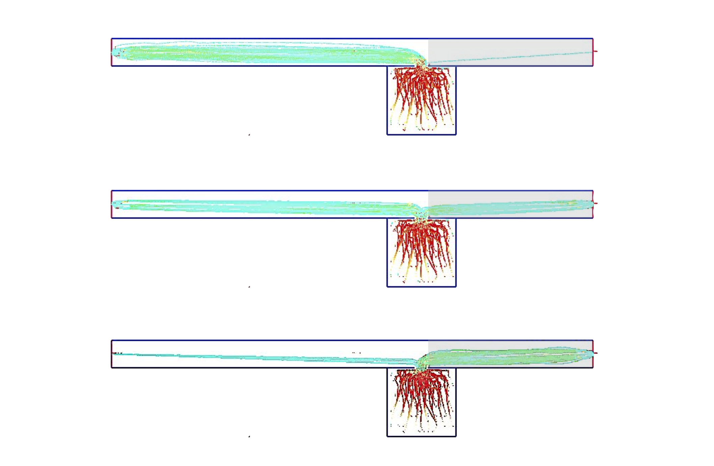

# Smoke Sensor


The smoke sensor is an input channel providing information in terms of smoke spread to the cognitive map of each pedestrian. For that purpose, CFD data from NIST's Fire Dynamics Simulator [(FDS)](https://github.com/firemodels/fds) can be processed and incorporated to JPScore.

In the following section, a small tutorial based on a very simple and artificial example is given. This artificial scenario is illustrated in the following figure.


*Scenario used in this wiki*

# File Structure

The directory `demos` contains some example files, especially `0_demo/`.
This demo was used to produce this [simulation](https://youtu.be/jJYEVYOD0L0).


**NOTE**: The fds data can be calculated by running the following command from the terminal: `fds jpsfire_demo.fds`

The directory `src` contains the script [src/preprocess_fds.py](https://gitlab.version.fz-juelich.de/jupedsim/jpsfire/blob/master/src/preprocess_fds.py). 
This script will read out slicefiles from the fds simulation and reshape it to a mesh. The values are then converted to smoke factors, which will result in a smoke factor grid that is provided to the cognitive map router inside ```jpscore```.


Please note that this is an exemplary file structure. If you want to use another structure, it might be necessary to modify the path definitions in the scripts.

## Pre-Processing - workflow

For simple cases like the supplied demonstration case, you can simply run ```preprocess_fds.py```. The script takes the following arguments:

argument | functionality
-------- | -------------
-q | specify quantity (default: ext. coeff.)
-d | specify axis of slicefile (default: Z)
-c | specify coordinate on axis (default: 2.25)
-p | set ```plots=True``` (default: False)
-j | specify path to JuPedSim directory (default: ../../JuPedSim/)
-s | specify start time for fds input (default: 0.0)
-e | specify end time for fds input (default: T_END from fds)
-g | specify resolution of smoke factor grids (default: 1.0)
-v | specify point of view for line of sight calculation: x,y (default: '12.5', ',', '5.5')
-ex | specify exit for line of sight calculation (default: trans_0)


However, once you have a multitude of slicefiles you want to process (e.g. multiple storeys), it is reasonable to use ```preprocess_fds.sh```, which will preprocess all necessary files for all modules.

## Pre-processing - results

After script execution, the pre-processing is completed. Inside the ```FDS``` directory the following subdirectories have been created:

Directory | Content
------------- | -------------
sf_grids | Smoke factor grids that are provided to the cognitive map router. Subdirectories: location of slicefile + location of all processed crossings resp. transitions. In addition if ```plots=True```: .png plots of the smoke factor grid
grids | Data necessary for Walking Speed reduction and Toxicity Analysis. In addition if ```plots=True```: .png plots of the specified slicefiles for every single mesh


# Pedestrian Simulation

The converted data now needs to be incorporated into JPScore. This is done by specification in the JuPedSim project file. Please note that the following snippets do not represent the complete project file. Please use ```jpsfire_ini.xml```.

```
<JPSfire>
    <A_smoke_sensor smoke_factor_grids="../FDS/3_sfgrids/" update_time="20" final_time="120" />
</JPSfire>
```

The data imported from JPSfire is specified in the ```<JPSfire>``` section and its child ```<A_smoke_sensor>```.
The path specified as attribute of ```smoke_factor_grids``` points to the smoke factor grids calculated during the pre-processing. The tag ```update_time``` specifies the time interval for JPScore to import data from the pre-processing. The tag ```final_time``` specifies the time when no further data import will be conducted. Please note that the specified time magnitudes need to be compliant with the data generated during the pre-processing.

```
<agents_distribution>
    <group group_id="1" agent_parameter_id="1" room_id="0"
    subroom_id="0" number="30" router_id="7"         
    pre_movement_mean="100" pre_movement_sigma="0"
    risk_tolerance_mean="0." risk_tolerance_sigma="0."/>
</agents_distribution>

```

Within the ```<agents_distribution>``` section, the risk tolerance can be specified by either using a normal distribution with a mean value ```risk_tolerance_mean``` and standard deviation ```risk_tolerance_sigma``` or by using a beta distribution and specifying alpha and beta with ```risk_tolerance_alpha``` and ```risk_tolerance_beta``` respectively. Until now, the risk tolerance is supposed to consider the uncertainty about human behaviour when evaluating a certain state of smoke spread. This will be developed further in the coming months - work in progress. In order to investigate the dynamic interaction between the smoke spread and the evacuation process, it may be appropriate to adjust the pre-movement times.

To get variable pedestrian behavior in this wiki scenario, the following values are suitable:

expected risk behaviour | alpha | beta
------------- | -------------| -------------
low (taking no-smoke route)| 12.0 | 12.0
middle (50:50)|12.0 | 6.0
high (taking smoke route)|12.0 | 3.0


*Variation of ```risk_tolerance_alpha``` and ```risk_tolerance_beta``` to get variable pedestrian behaviour*


```
<router router_id="7" description="Smoke">
      <sensors>
	      <sensor sensor_id="2" description="Smoke" status="activated"/>
      </sensors>
      <cognitive_map status="complete" />
</router>
```

Within the ```<router>``` section, the smoke sensor gets initialized.

# Debugging

When encountering problems with the observed routing patterns, it is recommended to set ```plots=True``` in order to have a closer look at the results of the pre-processing. Having that, one can check if the locations of the crossings and transitions have been determined correctly. Additionally, one can specify a fixed agent position and exit using the arguments provided above. The resulting plots may look like:


*Visualisation of one line of sight towards the right exit for several optical conditions*


*Smoke factor grids at t=60s for crossings (doors) and transitions (exits), here: 1 door and 2 exits*


# Limitations and Pitfalls

* FDS mesh resolution: Up to now, only unique mesh resolutions can be analysed.

* Multiple floors: JPScore can import smoke factor grids for multiple-floor geometries.  However the cognitive map router still struggles with non-convex geometries - work in progress!

* Geometry file: It is assumed that the geometry file is located in the specified JuPedSim directory and that the filename contains the substring 'eo'.

* Be careful when combining the smoke sensor with other sensors (e.g. Room-to-Corridor) as the interaction may blur the routing patterns.

# Requirements

- FDS
- Python
