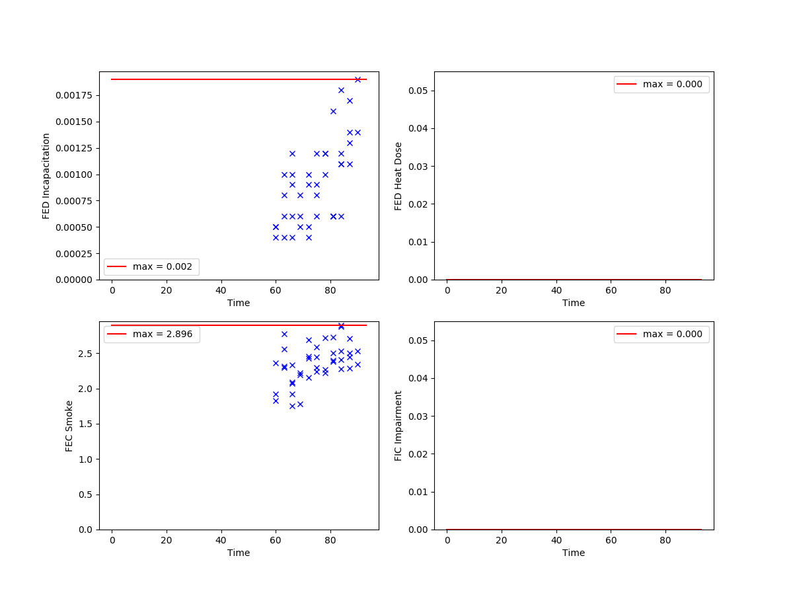

# Toxicity Analysis

This module of JPSfire is supposed to analyse the agent's individual exposures to fire hazards. For that purpose, CFD data from NIST's Fire Dynamics Simulator [(FDS)](http://firemodels.github.io/fds-smv/) can be processed and incorporated to JPScore. Notable research in this field has been conducted by Purser, whose work is the basis for the following implementations. 

# Workflow

The preprocessing data is already available when the smoke sensor has been used. The necessary data can be found in the ```FDS``` directory under ```grids``` inside the ```demos``` folder.
This data is again incorporated to JPScore. The relevant information needs to be specified in the JuPedSim project file. Please note that the following snippets do not represent the complete project file. Please use ```jpsfire_ini.xml```.

```
  <JPSfire>
    <A_smoke_sensor/>
    <B_walking_speed/>         
    <C_toxicity_analysis toxicity_grids="../FDS/grids/" 
      final_time="120" update_time="20" />
  </JPSfire>

```

Within the ```<JPSfire>``` section and its child ```<C_toxicity_analysis/>```, the path towards the grids is specified via ```toxicity_grids```. With ```update_time``` and ```final_time``` one can control the refreshment of the data import performed by JPScore.  Please note that the specified time magnitudes need to be compliant with the data generated during the pre-processing. The contents inside ```toxicity_grids``` are detected automatically. The most suitable extinction grid for a pedestrian is evaluated according to its actual elevation. This means multi-storey geometries are supported. 


# Output

The fire hazard analysis is conducted every three seconds of simulation time. The output is written out to an XML file denoted with the prefix ```toxicity_output_```, whose contents look as follows.

```
<?xml version="1.0" encoding="UTF-8"?>

<ToxicityAnalysis>
	<header version = "0.8">
	</header>

<frame ID="0">
  <agent ID="1" t="0" E="0.0000"  FEC_Smoke="0.0000"  c_O2="209000" 
                c_CO2="0" c_CO="0"  c_HCN="0" c_HCl="0" FED_In="0.0000" 
                FIC_Im="0.0000" FIC_In="0.0000" T="20.0"  FED_Heat="0.0000"/>

  [...]

  <agent ID="1" t="63"  E="0.4643"  FEC_Smoke="2.0186"  c_O2="208734" 
                c_CO2="229" c_CO="34" c_HCN="2" c_HCl="0" FED_In="0.0010" 
                FIC_Im="0.0000" FIC_In="0.0000" T="23.1"  FED_Heat="0.0000"/>

</ToxicityAnalysis>

```

The above-mentioned fire hazard log is constructed similarly to the trajectories. For every time step (here: 3 seconds) all relevant magnitudes are stored per agent. 

Using ```readout_toxicity.py```, the log is read out and plotted. An example plot is shown below.



*FED Incapacitation, FED Heat Dose, FEC Smoke, FIC Impairment*

# Debugging

When encountering problems with the observed dynamics, it is recommended to set ```plots=True``` in order to have a closer look to the results of the pre-processing. 

# Limitations and Pitfalls

* Height of evaluation: A height of 1.8 m above the ground level is assumed. Please consider this in the configuration of your fire simulation.   

* FDS mesh resolution: Up to now, only unique mesh resolutions can be analysed. 

# Requirements

* FDS
* Python

# Further Reading

* Purser, D. A. (2016). Combustion Toxicity. In Hurley, M., editor, SFPE Handbook of Fire Protection Engineering, book section 62. Society of Fire Protection Engineers, 5th edition.

* Purser, D. A. (2016). Developments in tenability and escape time assessment for evacuation modelling simulations. In Cuesta, A., Abreu, O., and Alvear, D., editors, Evacuation Modeling Trends, pages 25–53. Springer International Publishing, Cham.

* Purser, D. A. and McAllister, J. (2016). Assessment of Hazards to Occupants from Smoke, Toxic Gases, and Heat. In Hurley, M., editor, SFPE Handbook of Fire Protection Engineering, book section 62. Society of Fire Protection Engineers, 5th edition.
