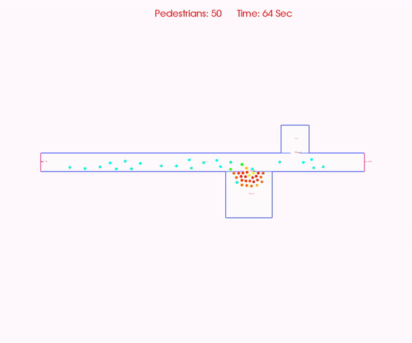

# Walking Speed Reduction in Smoke

This module of JPSfire is supposed to consider the decrease of agent's walking speeds when their sight is obstructed by smoke. For that purpose, CFD data from NIST's Fire Dynamics Simulator [(FDS)](http://firemodels.github.io/fds-smv/) can be processed and incorporated to JPScore. In the past, a couple of studies have been made regarding this phenomenon. Up to now, we implemented the studies of Jin (1978), Frantzich & Nilsson (2003) and a proposal by Fridolf (2018) which is based on all available data regarding this behaviour.



*Evacuation with reduced walking speed due to obstruction by smoke. The video below illustrates the walking speed reduction. The agents going to the left walk with normal speed, whereas agents on the right have reduced walking speeds. The study "Fridolf2018" was used for this demo.*


The used tutorial is the same as for the smoke sensor.

# Workflow

The preprocessing data is already available when the smoke sensor has been used. The necessary data can be found in the ```FDS``` directory under ```grids``` inside the ```demos``` folder.

This data is again incorporated to JPScore. The relevant information needs to be specified in the JuPedSim project file. Please note that the following snippets do not represent the complete project file. Please use ```jpsfire_ini.xml```.

```
  <JPSfire>
  	<A_smoke_sensor/>
   	<B_walking_speed         
           extinction_grids="../FDS/grids/EXTINCTION_COEFFICIENT/"
           update_time="10.0" final_time="100.0"
           study="Fridolf2018" irritant="false"/>
   	<C_toxicity_analysis/>
  </JPSfire>

```

Within the ```<JPSfire>``` section and its child ```<B_walking_speed/>```, the path towards the extinction grids is specified via ```extinction_grids```. With ```update_time``` and ```final_time``` one can control the refreshment of the data import performed by JPScore.  Please note that the specified time magnitudes need to be compliant with the data generated during the pre-processing. The contents inside ```grids``` are detected automatically. The most suitable extinction grid for a pedestrian is evaluated according to its actual elevation. This means multi-storey geometries are supported.
The string specified in ```study``` triggers the experimental data that shall be used for the correlation between extinction and walking speed. Available options are:

* "Jin1978"
* "Frantzich+Nilsson2003"
* "Fridolf2018"

In order to ensure a suitable application, none of these studies is set as default. The tag ```irritant``` determines if Jin's data set shall be interpreted for irritant or non-irritant smoke.

# Debugging

When encountering problems with the observed dynamics, it is recommended to set ```plots=True``` in order to have a closer look to the results of the pre-processing.

# Limitations and Pitfalls

* Height of extinction evaluation: A height of 1.8 m above the ground level is assumed. Please consider this in the configuration of your fire simulation.   

* FDS mesh resolution: Up to now, only unique mesh resolutions can be analyzed.

* The suitability of the implemented studies may depend on the intensity of the smoke obscuration.    

# Requirements

* FDS
* Python

# Further Reading

* M. J. Hurley, D. T. Gottuk, J. R. H. Jr., K. Harada, E. D. Kuligowski, M. Puchovsky, J. L. Torero, J. M. W. Jr., and C. J. Wieczorek, *SFPE Handbook of Fire Protection Engineering*, 5th ed., New York: Springer, 2016.
* E. Ronchi, S. Gwynne, and D. A. Purser, *Representation of the Impact of Smoke on Agent Walking Speeds in Evacuation Models*, Fire Technology, vol. 49, pp. 411-431, 2012.
* K. Fridolf et al., *Walking Speed in Smoke: Representation in Life Safety Verifications*, Conference Paper, 2018
